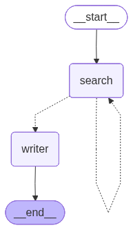

# Deep Research Agent 🔬

> **An autonomous AI research assistant that searches the web, gathers information, and synthesizes comprehensive reports using LangGraph + Groq LLM.**

[](https://www.python.org/downloads/)
[](https://langchain-ai.github.io/langgraph/)
[](https://opensource.org/licenses/MIT)

## 📊 Architecture



The agent uses a graph-based workflow with three key components:

1. **Search Node** - Gathers real-time web data using Tavily API
2. **Router** - Intelligently decides whether to continue searching or generate report
3. **Writer Node** - Synthesizes findings using Groq's Llama 3.3 70B model

## 🚀 What It Does

Takes any research question and:
- 🔍 Searches the web **3 times** with different strategies
- 📊 Gathers **real-time data** from multiple sources
- 🤖 Uses **Llama 3.3 70B** (via Groq) to write professional reports
- 💰 Tracks costs (average: **$0.009 per research cycle**)
- ⚡ Completes in ~18 seconds

### Example Output

**Query:** *"What is the current stock price of NVIDIA and why is it moving today?"*

**Result:**
- 3 web searches executed
- 2,662 tokens processed
- Comprehensive report with citations
- **Total cost: $0.009**

## 🎯 Why This Matters

Standard LLMs like ChatGPT have two critical limitations:

| Problem | Solution |
|---------|----------|
| **Knowledge Cutoff** - Can't access info after training | ✅ Live web search integration |
| **No Internet** - Cannot browse or search | ✅ Tavily API integration |

This agent bridges that gap, giving AI models access to current, real-time information.

## 🏗️ Tech Stack

- **Python 3.13** - Latest stable release
- **LangGraph** - Orchestration framework for AI agents
- **Groq API** - Fast, free LLM inference (Llama 3.3 70B)
- **Tavily** - Web search API optimized for AI
- **Pydantic** - Settings and validation
- **OpenAI SDK** - For Groq API compatibility

## ⚡ Quick Start

### 1. Clone & Setup

```bash
git clone https://github.com/kazisalon/Deep-Research-Agent.git
cd Deep-Research-Agent

# Create virtual environment
python -m venv venv

# Activate (Windows)
venv\Scripts\activate
# Activate (Linux/Mac)
source venv/bin/activate

# Install dependencies
pip install -r requirements.txt
```

### 2. Configure API Keys

```bash
# Copy environment template
cp .env.example .env

# Edit .env and add your keys
```

Get free API keys:
- **Groq**: https://console.groq.com (Free tier: 30 requests/minute)
- **Tavily**: https://tavily.com (Free tier: 1000 searches/month)

### 3. Run the Agent

```bash
python main.py
```

## 📁 Project Structure

```
Deep-Research-Agent/
├── config/
│   ├── settings.py          # Centralized configuration
│   └── __init__.py
├── src/
│   ├── agent/
│   │   ├── state.py         # Type-safe state definition
│   │   ├── nodes.py         # SearchNode & WriterNode
│   │   ├── routers.py       # Decision logic
│   │   └── graph.py         # LangGraph workflow
│   ├── tools/
│   │   └── search.py        # Tavily wrapper with retry
│   └── utils/
│       ├── logger.py        # Professional logging
│       └── cost_tracker.py  # API usage tracking
├── main.py                  # Entry point
├── generate_diagram.py      # Architecture diagram generator
├── requirements.txt
├── .env.example
└── README.md
```

## 🎨 Generate Architecture Diagram

Want to visualize the workflow? Run:

```bash
pip install grandalf
python generate_diagram.py
```

This generates `agent_architecture.png` directly from your code!

## 🔧 Configuration

Edit `.env` to customize:

| Variable | Description | Default |
|----------|-------------|---------|
| `GROQ_API_KEY` | Groq API key | Required |
| `TAVILY_API_KEY` | Tavily search API key | Required |
| `MAX_SEARCH_ATTEMPTS` | Number of searches | 3 |
| `MAX_SEARCH_RESULTS` | Results per search | 3 |
| `MODEL_TEMPERATURE` | LLM creativity (0-1) | 0 |
| `LOG_LEVEL` | Logging verbosity | INFO |
| `TRACK_COSTS` | Enable cost tracking | true |

## 💡 Customization

### Change Research Query

Edit `main.py`:

```python
user_query = "Your research question here"
```

### Adjust Search Depth

In `.env`:

```bash
MAX_SEARCH_ATTEMPTS=5  # Do 5 searches instead of 3
```

### Switch LLM Model

In `src/agent/nodes.py`, change:

```python
model="llama-3.3-70b-versatile"  # to another Groq model
```

Available Groq models:
- `llama-3.3-70b-versatile` (Best quality, used by default)
- `llama-3.1-8b-instant` (Faster, cheaper)
- `gemma2-9b-it` (Good balance)

## 📊 Cost Analysis

Based on actual usage:

| Component | Cost | Notes |
|-----------|------|-------|
| Tavily Search | $0.001/search | 3 searches = $0.003 |
| Groq LLM | ~$0.006/query | Free tier available |
| **Total** | **~$0.009** | Per research cycle |

**Annual cost** (100 queries/day): ~$328

Compare to:
- OpenAI GPT-4: ~$50/100 queries
- Claude 3 Opus: ~$75/100 queries

## 🚀 Advanced Features

### Production Deployment

See `interview-prep.md` for:
- FastAPI wrapper
- Redis caching
- Docker deployment
- Monitoring setup

### Testing

```bash
pytest tests/  # (tests not included yet - contribute!)
```

## 🎓 Learning Resources

This project demonstrates:

✅ **Agentic AI Patterns** - ReAct, tool use, decision-making  
✅ **LangGraph** - Graph-based orchestration  
✅ **Production Python** - Type hints, logging, config management  
✅ **API Integration** - Groq, Tavily  
✅ **Cost Optimization** - Tracking and minimizing API costs  

## 🐛 Troubleshooting

### Python Version Issues

This requires Python 3.10+. Upgrade if needed:

```bash
# Download Python 3.13 from python.org
python --version  # Should show 3.13.x
```

### Import Errors

```bash
pip install --upgrade -r requirements.txt
```

### API Key Errors

Verify keys are set in `.env`:

```bash
cat .env | grep API_KEY  # Linux/Mac
type .env | findstr API_KEY  # Windows
```

## 🤝 Contributing

Contributions welcome! Areas for improvement:

- [ ] Add unit tests
- [ ] FastAPI REST API wrapper
- [ ] Redis caching layer
- [ ] Multi-agent collaboration
- [ ] Streaming responses
- [ ] Web UI

## 📄 License

MIT License - feel free to use in your projects!

## 🙏 Acknowledgments

Built with:
- [LangGraph](https://langchain-ai.github.io/langgraph/) - Orchestration framework
- [Groq](https://groq.com/) - Fast LLM inference
- [Tavily](https://tavily.com/) - AI-optimized search

## 📧 Contact

Questions? Open an issue or reach out:
- GitHub: [@kazisalon](https://github.com/kazisalon)
- Project: [Deep-Research-Agent](https://github.com/kazisalon/Deep-Research-Agent)

---

**⭐ If you found this useful, please star the repo!**

Built with ❤️ using Python 3.13, LangGraph, and Groq
